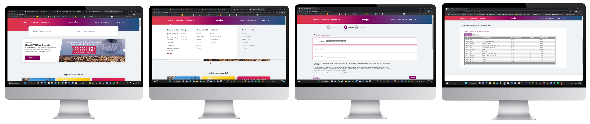
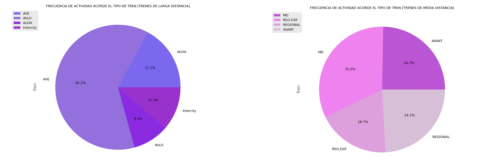
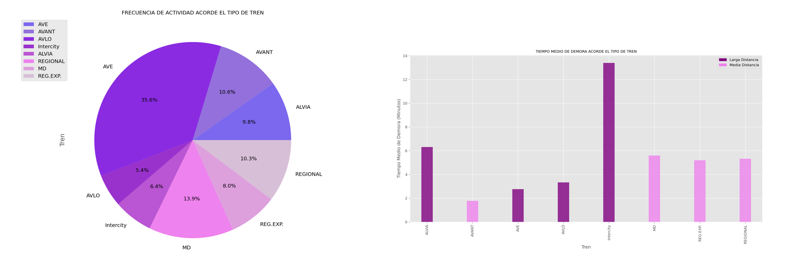

# ANALISIS-DE-DATOS-RENFE-MEDIANTE-WEB-SCRAPING

Este proyecto utiliza web scraping para recopilar y analizar datos sobre los trenes de media y larga distancia en Renfe. Se obtienen horarios, llegadas y retrasos en distintas estaciones, mediante técncias de Web Scraping, y se almacenan en un archivo CSV. Posteriormente, se visualizan los resultados mediante gráficas para identificar patrones de uso y retrasos.

## Autor

- [Fátima Fuchun Illana Guerra](https://github.com/Fatima-Illana)

## Objetivo

El objetivo de este proyecto es analizar cuáles son los tipos de trenes de media y larga distancia más utilizados y cuáles presentan mayores tiempos de retraso en distintas estaciones de la red de Renfe. Con esta información, se crean visualizaciones que facilitan el análisis de las tendencias en puntualidad y frecuencia de los trenes.

## Previsualización Proceso Web Scraping

## Previsualización Resultados

## Estructura del Proyecto

- **HorariosRenfeWebScraping.py**: Script the Python que realiza web scraping de los datos en la página de Renfe de 1 sola estación, y lo almacena en el archivo 'HorariosLargaDistancia.csv'.
- **VariasEstacionesWebScraping.py**: Script de Python que realiza el web scraping de los datos en la página de Renfe de varias estaciones y los almacena en el archivo 'HorariosLargaDistancia2.csv'.
- **Carpeta Datos/**: Carpeta donde se almacenan los archivos CSV generados con los datos extraídos:
  - **CSVAcumulativo.csv**: es un archivo CSV que recopila el resultado de ejecución de 'VariasEstacionesWebScraping.py' a lo largo de varios días. Es el csv empleado para el análisis final, para poder contar con más datos de varios días.
- **GraficasAnalisis.csv**: Script de Python que realiza un estudio de los datos y genera las gráficas finales. 
- **Carpeta Graficas**: Carpeta donde se guardan las visualizaciones generadas a partir de los datos.
- **InformeAnalisisRenfe**: Informe que muestra gráficamente el proceso de extracción de datos y la visualización de las gráficas finales. 

## Requisitos

Para ejecutar este proyecto, necesitas:

- **Python 3.x**
- Bibliotecas de Python:
  - `Driver` (para permitir la interacción con un navegador web, en este caso Chrome)
  - `Selenium` (para la extracción de datos mediante Web Scraping)
  - `BeautifulSoup` (para parsing de HTML)
  - `pandas` (para manipulación de datos)
  - `matplotlib` (para visualización de datos)
